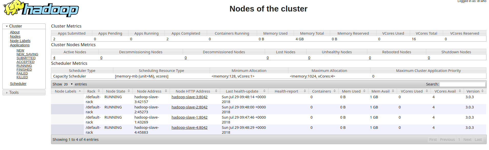

# hadoop-docker-cluster

## Hadoop Installation

### Add user to docker group
`sudo groupadd docker`
`sudo usermod -aG docker $USER`

Logout of your session and back in again and you will be able to use `docker` commands without `sudo`. 

### Docker Network
`docker network create --driver=bridge hadoop`

### Build

`./build.sh`

### Start

`./start.sh`

### Hadoop

Start namenode:

`./start-hadoop.sh`

Start slave nodes:

`./start-slaves.sh`

### Verify

`hdfs dfsadmin -report`

## Examples

Replace `3.0.3` in any filenames with your Hadoop version.

### 1) wordcount

Copy a file to HDFS:

`hdfs dfs -copyFromLocal /usr/local/hadoop/LICENSE.txt /license.txt`

Run the wordcount example:

`yarn jar /usr/local/hadoop/share/hadoop/mapreduce/hadoop-mapreduce-examples-3.0.3.jar wordcount /license.txt /test`

Dump the result to terminal:

`hdfs dfs -cat "/test/part-r-00000"`

### 2) pi
`yarn jar $HADOOP_HOME/share/hadoop/mapreduce/hadoop-mapreduce-examples-3.0.3.jar pi 10 100`

## Dashboard

go to `http://localhost:8088/cluster`

